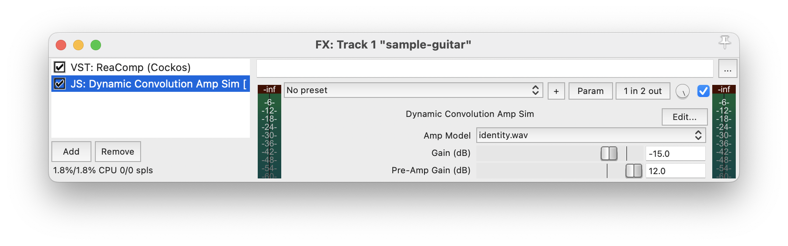

# JSFX Dynamic Convolution Amp Sim

Guitar Amplification and Effects Final Project

This repo holds the files necessary to use and run this guitar amp simulator in Reaper.

In this project, I built a guitar amp simulator plugin for the [Reaper DAW](https://www.reaper.fm/index.php), using Reaper's [JSFX language](https://www.reaper.fm/sdk/js/js.php).
The amp sim is inspired from the built-in JSFX plugins called `Convolution Amp/Cab Modeler` and `Convolution Dual Amp Modeler`, which simulate mono and stereo audio from guitar amps using a simple FIR system.
My project uses Dynamic Convolution to simulate the nonlinearity of amplifiers.



## Demo

I have uploaded a short video to [YouTube](https://youtu.be/lEtmua_1R3E) showing the sounds the plugin can make.
I downloaded a clean guitar sound from [FreeSound](https://freesound.org/people/loudernoises/sounds/453384/) and applied my four dynamic impulse response models to it in this order:

1. `identity`
2. `mac`
3. `bedroom`
4. `clip`

More information on the impulse responses is located in the [Recording Impulse Responses](#recording-impulse-responses) section.
Note that I also placed a dynamic compressor effect before the amp sim.

## Using the Plugin

The plugin is located in the `dynconv` file (JSFX files annoyingly don't use an extension).
The impulse responses I generated are located in the `irs` directory.
The plugin should be placed into Reaper's `Effects` directory.
Each impulse response file should be placed into Reaper's `Data` directory, in a new subdirectory titled `dynconv_irs`.
The plugin can be applied to a track using the "FX" option in Reaper.

The plugin provides three options in its interface:

1. Amp Model: select the impulse response file (corresponding to each different amp)
2. Gain (dB): set the gain of the amp's output
3. Pre-Amp Gain (dB): set the gain of the input to the amp, *before any processing*

Read the comments at the top of the file for more information on the plugin.

## Dynamic Convolution

In essence, "normal" linear convolution simulates LTI (linear, time-invariant) systems.
It takes a single constant impulse response `h[n]`, and, given an input signal `x[n]` with length `N`, the output is:

```text
        N
y[n] =  ∑  x[k]⋅h[n-k]
       k=0
```

Linear convolution makes the assumption that the system is fully characterized by its unit impulse response.
This is a valid approximation for many real systems.
However, guitar amps are intentionally nonlinear, so any FIR-based simulator won't sound very accurate.
But we can extend the idea of linear convolution to *dynamic* convolution.
With dynamic convolution, we record impulse responses for impulses of many different amplitudes.
Then, when we perform convolution, we choose the appropriate impulse response for every individual sample.
Mathematically, dynamic convolution is simply:

```text
        N
y[n] =  ∑  x[k]⋅hₘ[n-k]
       k=0
```

Here, `hₘ[n]` is the impulse response that most closely corresponds to the amplitude of `x[k]`.

To simulate a guitar amp (or really, any non-linear, time-invariant system) using dynamic convolution, we just need to feed impulses of varying amplitudes into the amp and record the sound that comes out.

## Generating Impulses

The `impulse.py` script has a function `generate_impulses`, which generates a file with impulses of different amplitudes.
Runnning this function will generate 32 impulses of amplitudes 0&nbsp;dB to -60&nbsp;dB, separated by 1 second.
16 positive impulses come first, then 16 negative impulses.

## Recording Impulse Responses

This part is specific to the particular audio recording setup and amp used.
Essentially, a computer should be connected to an audio interface that outputs to the guitar amp's input.
A mic should be placed by the amp's driver to record its response to the impulses.
The mic's output should be recorded, and the responses should be lined up exactly to the input impulses.
(Reaper in particular provides sample-accurate horizontal adjustment to audio items.)
Then the result should be exported to a `.wav` file with a 48&nbsp;kHz sample rate, exactly 34 seconds long.
(The first impulse response should be exactly 1 second = 48000 samples into the file.)

Unfortunately, I was unable to get access to a physical guitar amp to record impulse responses.
However, since this amp sim can be used for any nonlinear, time-invariant system, I recorded the response of my computer speakers and desk speakers.
These are `mac.wav` and `bedroom.wav`, respectively.
Frankly, because of the reverb and background noise in my apartment, these impulse responses are bad; but they do show that the process of recording impulse responses should work for actual guitar amps.

I also generated a couple impulse response files programmatically:

* `identity.wav` represents the do-nothing system: the impulse responses are `hₘ[n] = δ[n]` for all `m`.
* `clip.wav` represents hard clipping past -6.75&nbsp;dB: similar to `identity.wav`, except the impulse responses are scaled lower for higher amplitudes.

## Processing Impulse Responses

The `impulse.py` script also has a function `process_irs`, which takes the impulse response file and compacts it into the form that the plugin uses.
Essentially, it cuts up the file into 32 impulse responses, truncates them to 128 samples each, then pastes them back-to-back.
The result is written out the the finished impulse response `.wav` file.
